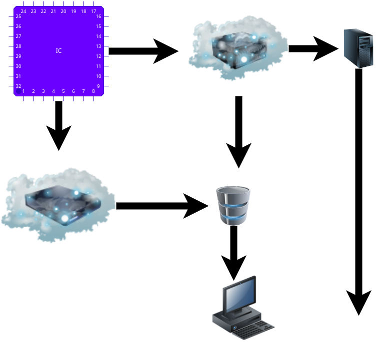

# Internet of Things
The collective network of connected device and the technology that facilitates communication between and the cloud and also between devices (i.e. a network of physical devices). The base of Internet Protocol and Transmission Control Protocol (TCP). The low cost chips available chips on todays market made IoT more affordable to all. This devices are also known as **smart object**. The IoT technology now-a-day's are making huge impact on everyday life, industries, transportation and etc.
  Iot enables us to:
* Improves efficiency with automation.
* Data-driven decision making.
* Cost saving.
* Enhanced customer experience.
* Big-data analytics. 

## History
After the huge exploitation of telegraph in the 19th century the IoT begins in 1960's.  The researchers started to explore connecting computers and systems. The finest invention was begin with *Coco-Cola vending machine* @ Carnegie Mellon University, it was connected to ARPANET (Advance Research Project Agency Network) and done by David Nichola, a graduate student. Along with him Mike Kazar, Ivor Durham and a research engineers at the university worked for it. **Internet of  Things** - term was made by Kevin Ashton in 1999, a British technologist. After invading WiFi technology to our world IoT made a drastic growth.  
Here are some of the key events in the history of the IoT:

    1982: A Coca-Cola vending machine at Carnegie Mellon University becomes the first ARPANET-connected appliance.
    1999: Kevin Ashton coins the term "Internet of Things."
    2000: The first smart home is introduced.
    2004: The first RFID tags are introduced.
    2008: The first Wi-Fi-enabled thermostat is introduced.
    2011: The first wearable fitness tracker is introduced (Fitbit).
    2015: The first connected car is introduced (Mercedes).
    2020: The number of IoT devices in use surpasses 30 billion.

## How it works?
The major objective of IoT device is real-time collection of data and exchange of it.

##  Made Possible
- Low-cost, Low-powered technologies.
- Connectivity.
- Cloud computing platforms.
- Machine learning and analytics.
- AI.

**lets see with programs**

